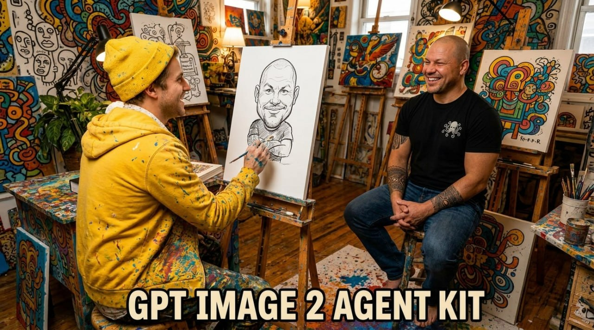

# GPT Image 2 Agent Kit




A local-first toolkit for agents and operators who want a safer image-generation workflow with GPT Image 2-compatible backends: better prompts, optional reference images, dry-run planning, receipts, and strict file boundaries.

**Unofficial community toolkit. Not affiliated with, endorsed by, or sponsored by OpenAI.**

Live generation is experimental and best-effort. It depends on your own compatible ChatGPT/Codex access, current product availability, rate limits, regional/account policy, and terms. The stable core of this repo is the local planning workflow: dry-run, references, identity/style/edit organization, receipts and path safety.

It is built from the lessons of an internal designer-agent workflow, but this public repo is sanitized: no private paths, no private facepack, no tokens, no internal agent names.

## Why this exists

Most image tools optimize for a human clicking a UI. This kit optimizes for an AI agent that must be safe before it spends quota or touches private references.

The flow is:

```text
request -> prompt plan -> identity/style/edit references -> dry-run -> receipt -> optional live generation
```

## Modes

- **Default / dry-run**: no token, no network, no image output. Prints a plan for agent/operator review.
- **Dry-run + receipt**: no token and no network; writes only the requested JSON receipt.
- **Review Markdown**: `--review-markdown` prints a human-readable plan with prompt, refs, output path and risk notes.
- **Live**: `--live` reads your configured token, sends the prompt and selected refs to the backend, and writes a PNG.
- **Identity**: `--identity NAME` reuses a saved local person/character reference pack.
- **Style**: `--style NAME` reuses a saved local brand/style/moodboard pack.
- **Edit**: `--edit-image IMAGE --edit "..."` modifies an existing image while preserving requested parts.

## What it does

- Turns a short request into a stronger image-generation prompt with reusable presets.
- Supports optional reference images for likeness, style, logo, composition, edits, or product context.
- Creates saved local identity packs, so an agent can later use `--identity me` instead of asking for the same face references again.
- Creates saved local style packs for brandbooks, creator styles, art direction and campaign look.
- Supports edit mode: pass a base image and ask what to change while preserving the rest.
- Uses dry-run by default so agents can inspect the plan before spending quota.
- Writes outputs only inside a configured safe root unless you explicitly override it.
- Produces JSON receipts with hashes/metadata, not raw secrets or image bytes.
- Can call a ChatGPT/Codex GPT Image 2 route if you provide your own compatible access token.

## What it is not

- Not a hosted image service.
- Not a quota bypass.
- Not “free unlimited GPT Image 2.”
- Not an official OpenAI Images API SDK.
- Not browser automation.
- Not a way to publish or share your subscription token.

Use wording carefully: this tool can use your existing compatible ChatGPT/Codex access where available. Product availability, model access, rate limits, and terms can change.

## Quick start

```bash
python -m pip install -e .
gpt-image2-agent --help
```

Dry-run a prompt plan without auth, network, or file writes:

```bash
gpt-image2-agent "portrait of a calm technical operator" \
  --preset portrait \
  --aspect square \
  --quality low \
  --dry-run \
  --json
```

Human-readable review plan:

```bash
gpt-image2-agent "portrait of a calm technical operator" \
  --preset portrait \
  --aspect square \
  --quality low \
  --dry-run \
  --review-markdown
```

Use a reference image in the plan. This repository intentionally does not include real face references; replace the path with your own local image:

```bash
gpt-image2-agent "make a cinematic Telegram avatar in the same likeness" \
  --ref path/to/your-reference.png \
  --preset likeness \
  --dry-run
```

Live generation is opt-in:

```bash
export CHATGPT_CODEX_ACCESS_TOKEN="...your token..."
gpt-image2-agent "clean product hero image, no text" \
  --live \
  --auth-provider env \
  --out generated/hero.png \
  --receipt generated/hero.receipt.json
```

## Reference-image workflow

Reference images are useful when the output should preserve:

- a person's likeness;
- a product shape;
- a brand style;
- a scene composition;
- a character or mascot.

Privacy note: in live mode, prompts and reference images are uploaded to the configured backend. Use `--dry-run` when you only want local planning.

## Presets

- `portrait` — clean portrait composition.
- `likeness` — stronger identity-preservation language for user-supplied references.
- `thumbnail` — high-contrast YouTube/Telegram visual, avoids tiny text.
- `product` — product/landing hero image.
- `no-text` — explicitly avoids generated text.
- `russian-text` — if text is needed, asks for short readable Cyrillic and clean typography.
- `edit` — preserve the base image while changing only the requested part.
- `brand-style` — follow a saved or supplied style system.

Presets are prompt additions, not magic. Check the final dry-run prompt before live generation.

## Saved identities, styles and edits

Create a saved identity from local references:

```bash
gpt-image2-agent --root . --add-identity me \
  --ref refs/me-front.png \
  --ref refs/me-side.png
```

Use it later:

```bash
gpt-image2-agent "make a cinematic image with me in a black technical studio" \
  --identity me \
  --preset likeness \
  --dry-run
```

Create and reuse a style pack:

```bash
gpt-image2-agent --root . --add-style graphite-brand \
  --style-prompt "dark graphite palette, clean premium lighting" \
  --style-preset brand-style \
  --ref refs/style-board.png

gpt-image2-agent "hero image for an AI automation course" \
  --style graphite-brand \
  --preset product \
  --dry-run
```

Edit an existing image:

```bash
gpt-image2-agent \
  --edit-image generated/source.png \
  --edit "remove the background, keep the person and lighting" \
  --dry-run
```

More detail:

- `docs/identity-style-edit-workflows.md`
- `docs/comparison.md`
- `docs/security-model.md`
- `docs/receipt-schema.md`
- `docs/schemas.md`
- `examples/prompts/` for copyable dry-run workflows
- `schemas/` for machine-readable receipt/identity/style schemas

## Safety model

Default behavior is conservative:

- dry-run is available and safe;
- output defaults to `./generated/gpt-image-2/`;
- output, prompt-file, refs and receipts must stay under `--root` by default;
- symlink escapes are blocked;
- existing output files require `--overwrite`;
- receipts exclude raw prompt text by default unless `--include-prompt-in-receipt` is set;
- tokens are redacted from errors.

## Auth providers

Supported token providers:

- `env` — reads `CHATGPT_CODEX_ACCESS_TOKEN` or `--token-env`.
- `file` — reads an explicitly provided `--token-file`.
- `command` — runs `--token-command` and reads token from stdout.

The command provider is powerful. Use only trusted local commands.

## Development

```bash
python -m pip install -e '.[test]'
python -m pytest
python -m gpt_image2_agent --help
```

Live smoke tests are not run by default. If you wire one, keep it behind an explicit env flag and never run it in normal CI.

## Public links / Полезные ссылки

- YouTube: https://youtube.com/@alekseiulianov
- Telegram channel - Sprut AI: https://t.me/Sprut_AI
- Telegram chat - Sprut AI: https://t.me/+eH-qNIDmud8zNDZi
- AI Операционка: https://t.me/tribute/app?startapp=sJyg

## Canonical source

This project is maintained by Aleksei Ulianov / Sprut_AI.
Original repository: https://github.com/AlekseiUL/gpt-image-2-agent-kit

If you found this project mirrored, repackaged, or redistributed elsewhere, check this repository as the source of truth.

## Attribution

Where permitted by the applicable license, if you reuse, fork, modify, package, or publish this work, keep the original copyright and license notice and link back to the canonical repository.

## Русская версия

Это локальный набор для работы с GPT Image 2 через агента или CLI. Он помогает не просто отправить короткий запрос, а собрать нормальный промпт, добавить референсы, проверить план без траты лимита и сохранить понятный отчёт о генерации.

Ключевая идея простая: сначала план, потом live-вызов. Без сюрпризов с файлами, токенами и приватными картинками.

Что умеет:

- улучшать запрос через готовые пресеты;
- работать с референсами лица, стиля, продукта или композиции;
- сохранять локальные identity packs: один раз добавили свои фото, потом агент может использовать `--identity me`;
- сохранять style packs: брендбук, визуальный стиль, moodboard, стиль автора;
- работать в edit mode: взять исходную картинку и изменить только то, что попросили;
- делать `dry-run` без токена, сети и записи результата;
- выводить понятный Markdown-план через `--review-markdown`, чтобы агент или человек мог проверить запрос до live-вызова;
- писать результат только в безопасную папку;
- сохранять receipt без токенов и без сырых картинок;
- запускать live-генерацию только когда вы сами передали доступ.

Чего он не делает:

- не даёт бесплатный безлимит;
- не раздаёт чужой доступ;
- не является официальным SDK OpenAI Images API;
- не кликает браузер;
- не превращает личную подписку в публичный сервис.

Для лица/похожести используйте свои референсы осознанно. В live-режиме промпт и изображения уходят во внешний backend. Если нужно только подготовить запрос — используйте `--dry-run`.
